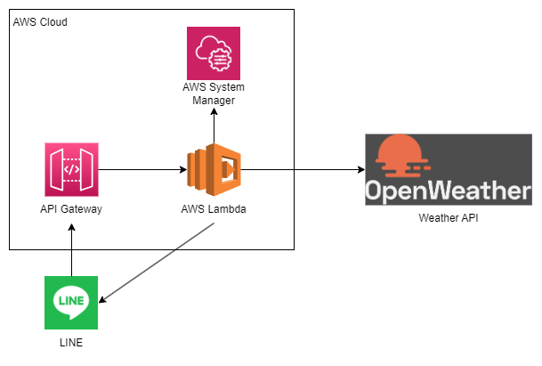

# Weather-Bot

## Weather-Botとは？
- LINE上で天気予報を取得するアプリです。  
  天気予報は「[OpenWeather](https://openweathermap.org/)」で取得しています。

## 機能
- 現在天気取得機能  
  設定された地域の現在天気を取得します。
- 翌日天気取得機能  
  翌日までの3時間ごとの天気を取得します。
- 翌日天気配信機能  
  毎日0時に天気予報を配信します。
  配信設定は「AWS Scheduler」で設定しています。
- 位置情報設定機能  
  LINEから送信された位置情報をAWS上のParameter Storeに設定します。
- 都市情報設定機能  
  LINEから送信された都市情報をAWS上のParameter Storeに設定します。
- 予報地域特定切り替え機能  
  天気予報で利用する地域パラメータを以下2つから設定します。
  - 緯度、経度
  - 都市名
- 現在設定確認機能  
  AWS上のParameter Storeに設定されたデータを確認します。  

## アーキテクチャ


## Python Version
```
> python -V
> Python 3.9.0
```

## モジュール
- boto3 1.26.94  
- line-bot-sdk 2.4.1 